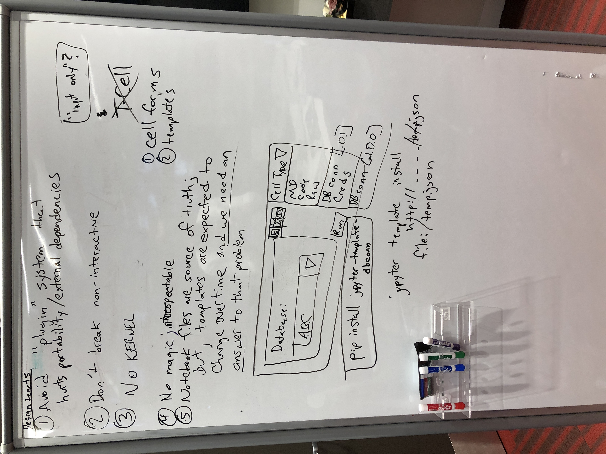

# Cell Forms

## Design Tenets

1. Avoid "plugin" system that hurts portability/external dependencies
2. Don't break non-interactive
3. No Kernel involved
4. No magic; introspectable
5. Notebook files are source of truth; templates are expectecd to change over time and we need an answer to that problem



```
pip install jupyter-cell-form-dbconn
```

vs.

```
jupyter template install http://example.com/cell-forms/dbconn.json
```

## Notebook Level Metadata

* packages/deps/environment configuration
* in-use templates (drop down section #2)

## Cell-level Metadata

* ref to nb-level templates entry

```js
{
  cell_type: "code"
  source: "# Generated Code ...",
  metadata: {
    form: {
      type: { vendor, name, version },
      values: { ... }
    }
    
  }
}
```

## Jupyter Server Configuration

* json files but (extensible / overridable for `/hub`)
* config dir? data dir?

## UI Logic in JS

* Toggle Views
* JSON Schema --> Render form
* Find data dependencies and GET on the extension path
* Run button

## Jupyter Server Extension

* `/api/cell-forms`
* (available-to-create)
* (dd section #1)
* `/api/cell-forms/vendor/name/version`
  * POST
  * --> form-fields
  * <-- rendered code

## JupyterTemplateApp

* JupyterApp
* Adheres to data dir
* Stores templates in `/templates`

## Template definition

* `vendor`
* `display_name`
* `version`
* `lang => template contents (Jinja)`
* `schema: {}`
* `server-reqs`

